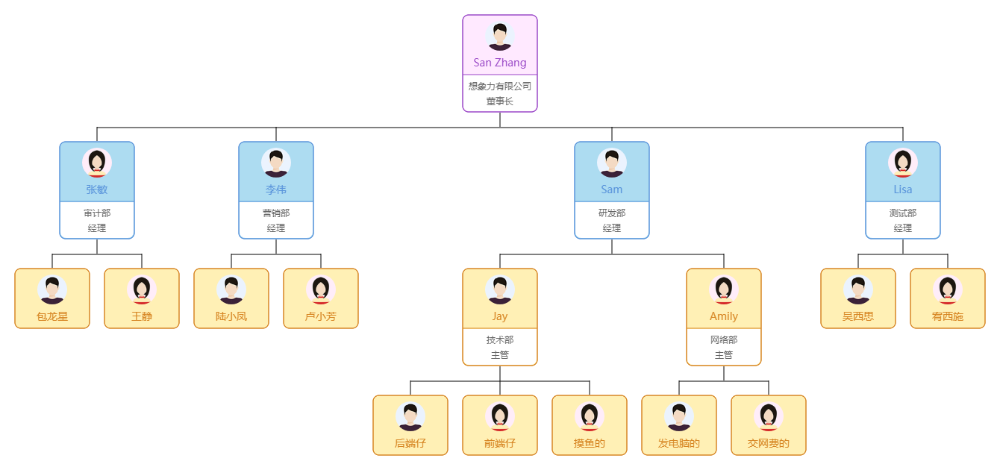

# Canvas-OrgChart
基于 canvas 元素绘制组织架构图.

## Installation
<!-- Of course, you can directly use the standalone build by including canvas-orgchart.js in your webapps. -->

### Install with npm
```
$ npm install canvas-orgchart
```

## Usage

### Instantiation Statement
```html
<canvas id="canvas"></canvas>
```

```js
import CanvasOrgChart from 'canvas-orgchart'

const canvas = document.getElementById('canvas')
const canvasOrgChart = new CanvasOrgChart(canvas, options)

canvasOrgChart.render(data)
```

### Structure of Datasource
```js
{
  name: 'self', // necessary.
  sex: 0,
  children: [ // necessary and must be an array.
    {
      name: 'son',
      sex: 0,
      children: []
    }
    ...
  ]
}
```

### Options
|       Name      |       Type      |    Default    |                    Description                   |
| --------------- | --------------- | ------------- | ------------------------------------------------ |
| width           | number          | 0             | Canvas 宽度，填 0 时自动计算宽度。                 |
| height          | number          | 0             | Canvas 高度，填 0 时自动计算高度。                 |
| padding         | array           | [0, 0, 0, 0]  | Canvas 内边距，和 CSS padding 类似。              |
| background      | string          | transparent   | Canvas 背景颜色。                                 |
| lineColor       | string          | black         | 组织架构图中连接线的颜色。                          |
| node            | object          |               | 节点样式。                                        |
| node.width      | number          | 0             | 节点宽度。                                        |
| node.height     | number          | 0             | 节点高度。                                        |
| node.spacing    | array           | [20, 20]      | 节点与节点间的距离。                               |
| node.radii      | number          | 8             | 节点边角的弧度半径。                               |
| node.background | string          | white         | 节点背景颜色。                                    |
| node.borderColor| string          | black         | 节点边框颜色。                                    |
| node.avatar     | object \| null  | null          | 节点头像样式。                                    |
| node.avatar.url | string          |               | 节点头像图片 url 地址。                           |
| node.avatar.offsetX  | number     | 0             | 头像在水平方向上的偏移量。                         |
| node.avatar.offsetY  | number     | 0             | 头像在垂直方向上的偏移量。                         |
| node.avatar.width | number        | 0             | 头像宽度。                                        |
| node.avatar.height| number        | 0             | 头像高度。                                        |
| node.avatar.circle| boolean       | false         | 是否为圆框头像。                                  |
| node.name       | object \| null  | null          | 节点名字样式。                                    |
| node.name.offsetX | number        | 0             | 文字在水平方向上的偏移量。                         |
| node.name.offsetY | number        | 0             | 文字在垂直方向上的偏移量。                         |
| node.name.color | string          | black         | 文字颜色。                                        |
| node.name.font  | string          |               | 文字样式。                                        |
| node.name.textAlign | string      | center        | 文字水平方向上的对齐方式。                         |
| node.descs      | object \| null  | null          | 节点描述区域样式。                                 |
| node.descs.height| number         | 0             | 描述区域高度。                                     |
| node.descs.background | string    | black         | 描述区域背景颜色。                                 |
| node.descs.font  | string         |               | 文字样式。                                        |
| node.descs.textAlign | string     | center        | 文字水平方向上的对齐方式。                          |
| node.descs.offset  | object[]     | []            | 描述区域文字的偏移量。                             |
| node.descs.offset.offsetX | number| 0             | 文字在水平方向上的偏移量。                         |
| node.descs.offset.offsetY | number| 0             | 文字在垂直方向上的偏移量。                         |

#### Options Example
```js
options = {
  width: 0,
  height: 0,
  padding: [20],
  background: '',
  lineColor: 'black',
  node: {
    width: 100,
    height: 100,
    spacing: [20, 20],
    radii: 8,
    background: 'white',
    borderColor: 'black',
    avatar: {
      url: '',
      offsetX: 0,
      offsetY: 0,
      width: 0,
      height: 0,
      circle: false
    },
    name: {
      offsetX: 0,
      offsetY: 50,
      color: 'black',
      font: '14px sans-serif',
      textAlign: 'center',
    },
    descs: {
      height: 0,
      color: 'black',
      background: 'white',
      font: '12px sans-serif',
      textAlign: 'center',
      offset: [
        {
          offsetX: 0,
          offsetY: 100,
        },
        {
          offsetX: 0,
          offsetY: 200,
        }
      ]
    },
  },
}
```

### Methods
|       Name      |       Params    |    Returns    |                    Description                   |
| --------------- | --------------- | ------------- | ------------------------------------------------ |
| render          | data            | undefined     | 渲染组织架构图。                                  |
| addEventListener| event, callBack | undefined     | 注册事件监听器，当触发指定事件时，对应的回调函数被执行。目前仅支持 select 事件。|
| removeEventListener | event, callBack | undefined | 注销事件监听器。                                  |

## Screenshots

